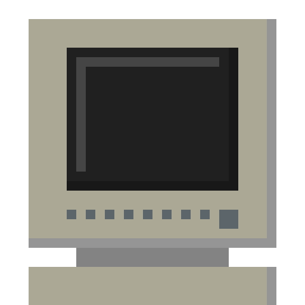

<div>
  
</div>

```diff
riyu@arch :: ~ » @fetch
@@ interested in {*nix,foss,cs} @@
+ more info: https://riyuzenn.me
# _[]={16,3,-13,-94};___=98;__=0;
# main(){for(;__<5;++__){putchar(___);___+=_[__];}}

```
