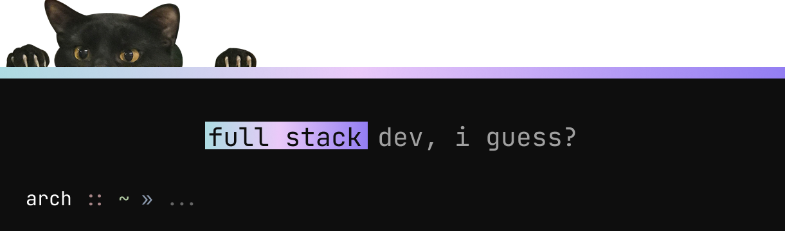

<!--

  

‎

  

  

-->

   <samp>
   yo, im ryuu
    
   yet another unmotivated programmer. i enjoy building stuff from scratch.  
  using mostly rust & node 
    
   </samp>

<samp> ~
   <a href="https://riyuzenn.vercel.app">boring portfolio</a>
   ·
   <a href="https://discord.com/users/418872913576591383">add me on discord</a>
   ·
   <a href="https://github.com/riyuzenn">recursion</a>
   ~ </samp>  
   

