<div>
  
</div>

<p>‎</p>

<div>
  
</div>


```diff

riyu@arch :: ~ » @fetch
@@ interested in {*nix,foss,cs} @@
# most commits were automated
+ more info: https://riyuzenn.me
- riyuzenn{@pm.me,@gmail.com}

```
<p>‎</p>
<!--    -->
<div align="left">

</div>
