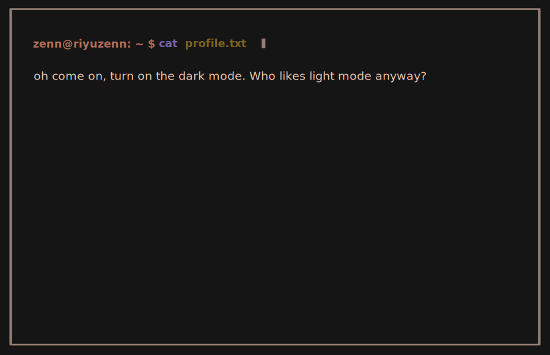

<!--  -->
<!--  -->

  <h3>─────※ ·❆· ※─────</h3>

<h2 align="center">
  :sparkles: <samp>whoami </samp>
</h2>
   
   an open-source enthusiast who's passionate on how stuff works & obsessed in innovating and building things from scratch <a href="https://riyuzenn.me">...</a>
     
   
   Here are more information about my <a href="https://github.com/riyuzenn/dotfiles">dotfiles</a> setup:
   
   - **OS:** [arch](https://archlinux.org)
   - **WM:** [bspwm](https://github.com/baskerville/bspwm)
   - **Terminal:** [alacritty](https://github.com/alacritty/alacritty)
   - **Shell:** [zsh](https://www.zsh.org/)
   - **Panel:** [polybar](https://github.com/polybar/polybar)
   - **Compositor:** [picom](https://github.com/ibhagwan/picom)
   - **Editor:** [neovim](https://github.com/neovim/neovim)
   - **Notification:** [dunst](https://github.com/dunst-project/dunst)
   - **Launcher:** [rofi](https://github.com/davatorium/rofi)

  
stats

   
  

